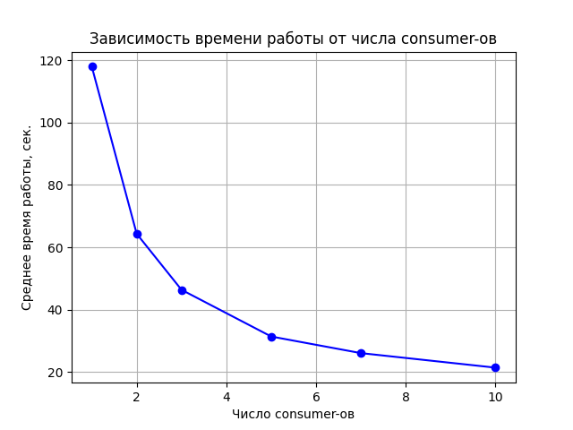

# Producer - Consumer schema
---
Репозиторий представляет собой контейнеризированную схему шаблона "Producer - Consumer", используя docker-compose. Producer считывает данные из файла data.txt в формате **Имя Фамилия Отчество Номер_телефона** и передает в очередь **RabbitMQ**. Каждый из consumer-ов независимо друг от друга обрабатывает строку с данными и сортирует их по первой букве фамилии, записывая в соответствующий файл директории **/output**.

## Запуск
Используйте bash-скрипт run.sh для запуска схемы. При этом не забудьте дать скрипту нужные права через **chmod +x run.sh**.
* Если хотите, чтобы docker выводил логи, то используйте флаг --logs;
* Регулируйте количество consumer-ов, передав число в качестве аргумента командной строки;

```
chmod +x run.sh
./run.sh --logs 3
```

## Отслеживание производительности
В директории results с помощью python-скрипта был нарисован график зависимости времени выполнения системы от количества consumer-ов. Как видно из графика, чем больше число consumer-ов, тем быстрее система завершает работу.



## Генерация новых данных
В директории data_generator описан класс GeneratorData, при помощи которого и создавались тестовые данные. Таким образом, можно сгенерировать файл на произвольное количество строк.